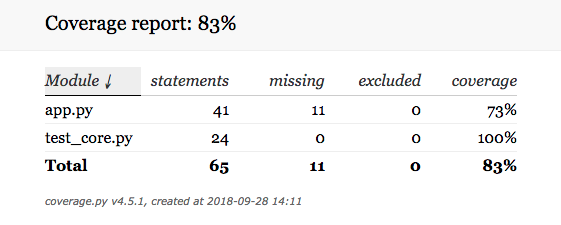

# Elo7 Challenge

Desafio: [Link](https://gist.github.com/elo7-developer/76615b155b12a1dc501dc4de1e69c6ff)

---

**Contexto técnico**: Desenvolver uma API que seja facilmente plugável ao fluxo de entregas e que armazene os paramêtros solicitados no desafio.

---

**Estrutura do projeto**

A API foi desenvolvida em Python com Flask e MongoDB.

Está 100% em Docker, apenas com o **requirements.txt** persistido dentro do container.

Isso diminui o tempo de build e deploy desta API.

---

**Projeto**

O projeto contém alguns testes unitários que estão localizados aqui:

```python
test_core.py
```

E aqui está a cobertura de código da API:



**Start da API**

```bash
/bin/bash -c "$(curl -fsSL https://raw.githubusercontent.com/orafapires/elo7_challenge/master/start-api.sh)"
```

---

**Endpoints**

> /

*Página inicial da API*

Método: **GET**

> /deploy-time

*Responsável pelo armazenamento dos seguintes dados:*

* Componente: Componente que está em processo de deploy
* Versão: Versão que está sendo entregue
* Responsável: Nome do membro do time de engenharia que * está realizando o processo de deploy
* Status: Status do processo de deploy

> /deploys-export

*Responsável pela exportação dos dados em formato CSV*

---

**Integração no CI**

Para a devida integração, só é necessário carregar o seguinte script:

```bash
source manage-api.sh
```

Feito isso, é só utilizar a seguinte função com os seguintes paramêtros:

```bash
post_to_api '{"component" : "teste", "version" : "2.0", "accountable" : "eu", "status" : "teste"}' http://localhost:5000 deploy-time
```

*Obs.:* Os dados acima são mockados e é necessário preparar o CI de forma que os paramêtros acima sejam preenchidos.

---


